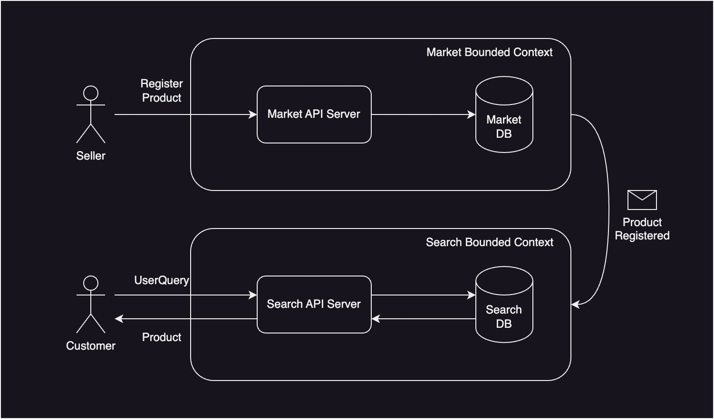
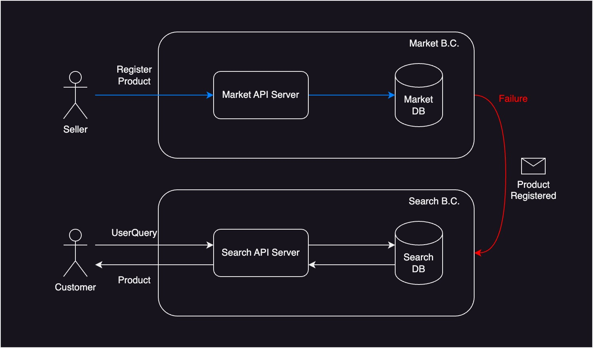
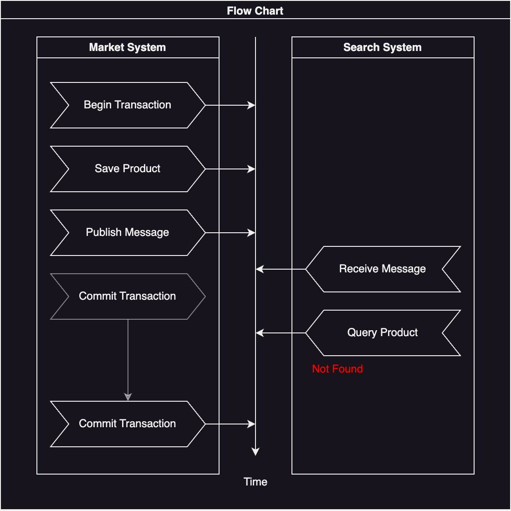
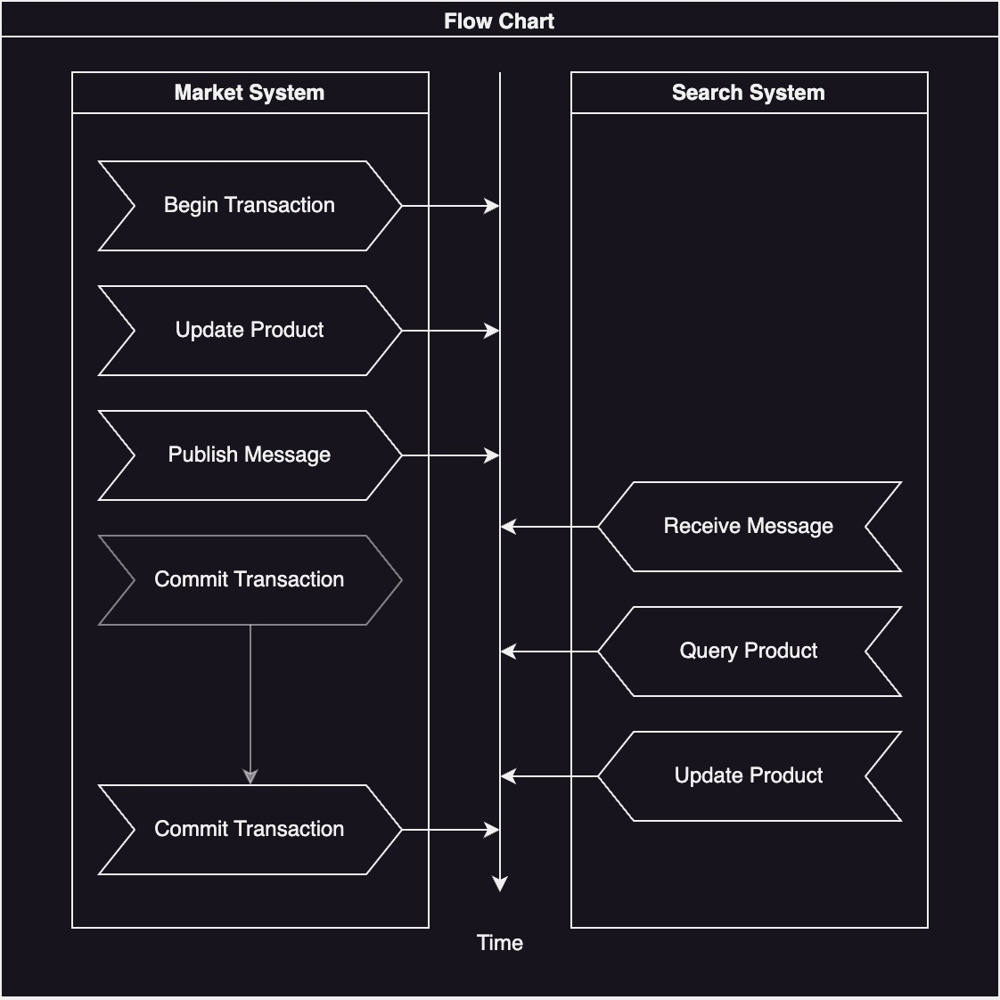
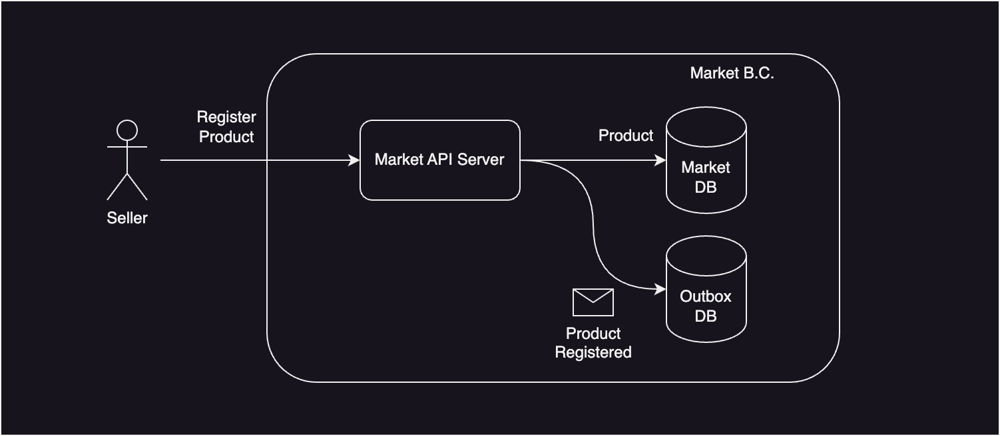
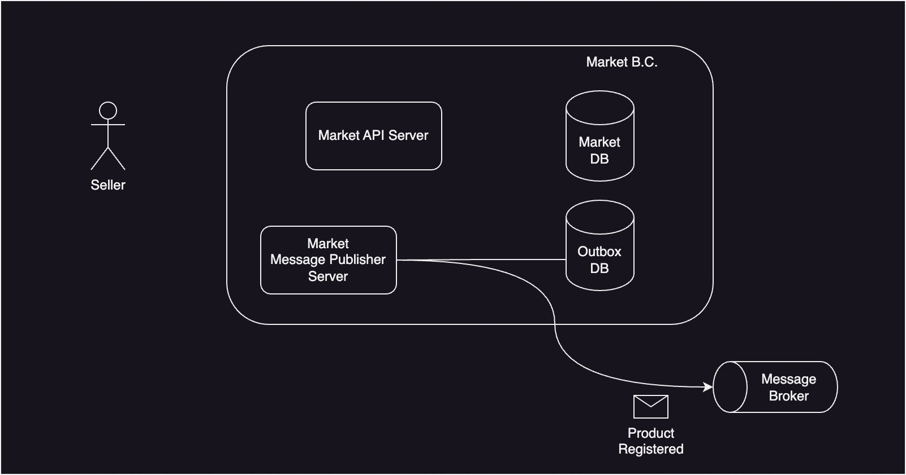
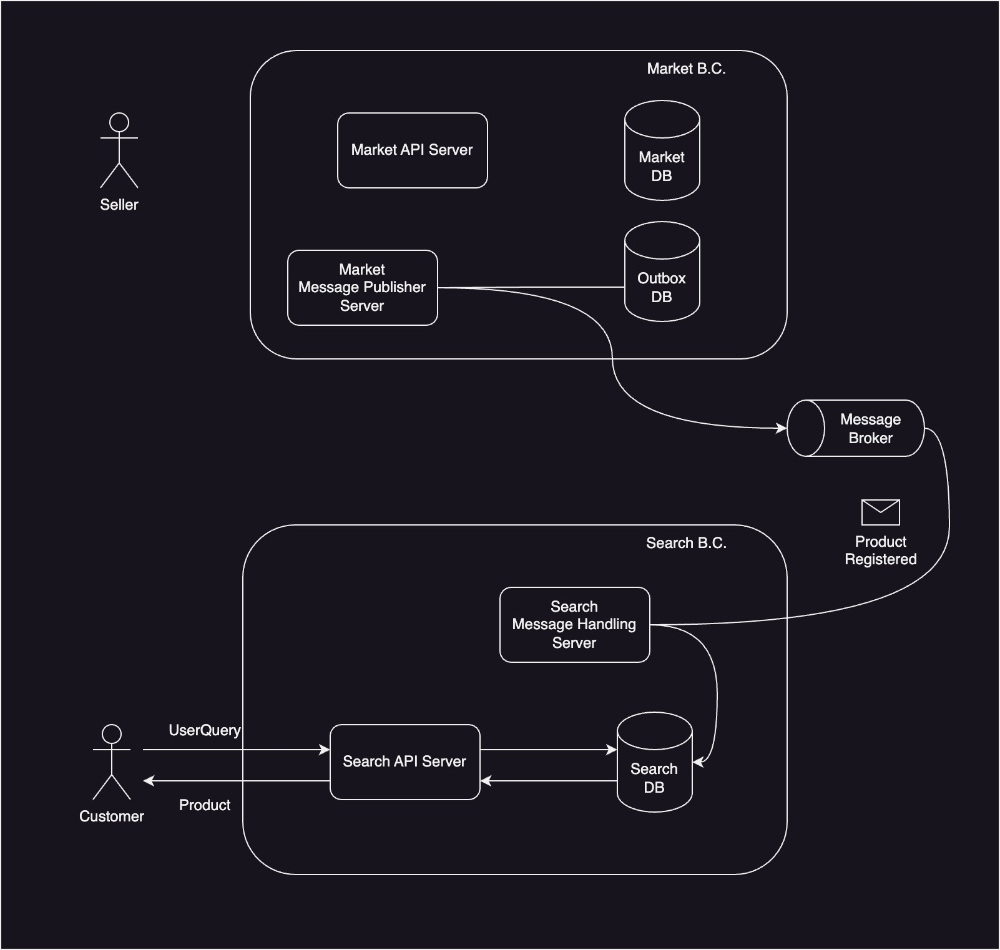

(이 글은 [강남언니 공식 블로그](https://blog.gangnamunni.com/post/transactional-outbox)에 게재되어 있습니다.)

안녕하세요. 강남언니 광고 스쿼드에서 광고 시스템을 만들고 있는 백엔드 개발자 Joon입니다. 저는 강남언니 유저들에게 더 많은 가치를 지속적으로 전달할 수 있는 구조, 즉 지속 성장이 가능한 구조에 관심을 가지고 있습니다.

강남언니 제품은 여러 개의 시스템으로 구성됩니다. 시스템끼리 소통하는 방법은 여러 가지가 있는데, 그중 하나는 메시징(Messaging) 방식입니다. 중앙 집중식 시스템에 비해, 분산 시스템에서는 데이터의 일관성을 확보하기가 상대적으로 어렵습니다. **발행되지 않아야 하는 메시지가 발행되거나, 발행되어야 하는 메시지가 발행되지 않고 누락되기도 합니다.** 이번 글에서는 간단한 예시와 함께, 흔히 볼 수 있는 메시지 발행, 처리 방식들의 문제점들을 짚어보려고 합니다. 또한 이 문제점들을 해결하는 방법 중 하나인 **Transactional Outbox Pattern**을 소개하겠습니다.

강남언니 내부 시스템은 비즈니스 서브 도메인 단위로 구성되는 경우가 많아, 도메인 이벤트가 메시지 내용물이 되는 경우가 많습니다. 이전에 ‘[트랜잭션은 도메인 모델이 아니다](https://blog.gangnamunni.com/post/isolate-transaction-from-domain-model/)’ 글에서 강남언니 성과형 광고 시스템&ast;이 도메인 이벤트를 어떻게 처리하고 있는지 따로 소개해 드리겠다고 말씀드렸었는데, 성과형 광고 시스템 역시 Transactional Outbox Pattern을 사용하고 있습니다. 글의 마지막에는 성과형 광고 시스템이 도메인 이벤트를 어떻게 다루고 있었는지를 다시 훑어보면서 글을 마무리하겠습니다.

---
&ast;강남언니 성과형 광고 시스템은 노출, 클릭 등의 성과가 발생할 때마다 병원에게 광고비를 받는 시스템입니다.

## **잘못된 메시지 처리 프로세스**

잘못된 메시지 처리 프로세스를 소개해 드리기 위해 간단한 예시 시스템을 정의해 보겠습니다.



판매자는 상품을 등록하고, 사용자는 상품을 구매할 수 있는 간단한 커머스 시스템입니다. 상품의 등록, 구매 등은 마켓 시스템이 관리합니다. 사용자는 검색을 통해 상품을 찾을 수 있는데, 사용자의 검색어를 상품과 잘 매칭하고, 또 적절한 추천 검색어를 제공하기 위해서 검색 시스템을 별도로 운영한다고 하겠습니다.

두 시스템은 각자의 데이터베이스를 운영합니다. 마켓 시스템은 관계형 데이터베이스를 사용하는 반면, 검색 시스템은 다양한 검색 요구사항을 만족하기 위해서 Elasticsearch를 사용할 수 있습니다. 마켓 시스템에서 상품이 등록되거나, 가격 정보가 변경되거나, 재고가 소진되는 등의 사건이 발생하면 이것은 검색 시스템에도 반영되어야 합니다. 두 시스템 간의 동기화 작업은 메시징 방식을 이용한다고 해 보겠습니다.

### **발행되어야 하는 메시지가 발행되지 않는다**

마켓 시스템은 상품이 새로 등록되면 메시지를 발행하려고 합니다. 간단하게, `MarketService`가 상품을 등록하고 나면, `MarketController`는 상품이 등록되었다는 메시지를 발행합니다.

```java
public class MarketService {

    private final IMarketRepository repository;

    ...

    @Transactional
    public Product registerProduct(RegisterProduct command) {
        validate(command);
        var product = Product.create(command);
        repository.save(product);
        return product;
    }
}
```

```java
@RestController
public class MarketController {

    private final MarketService service;
    private final IMessagePublisher publisher;

    ...

    @PostMapping(...)
    public void registerProduct(
        @RequestBody RegisterProduct command
    ) {
        Product product = service.registerProduct(command);
        var message = ProductRegistered.from(product);
        publisher.publish(message);
    }
}
```

이 방식의 문제는 **발행되어야 하는 메시지가 발행되지 않을 수 있다**는 것입니다. 위 코드 예시에서 `publisher.publish(message)` 코드 실행 중 예외가 발생하면 어떻게 될까요? 이미 상품을 저장하는 트랜잭션은 커밋되어 마켓 시스템의 데이터베이스에는 새로운 상품이 저장되었습니다. 하지만 상품이 등록되었다는 메시지는 발행되지 않고, 검색 시스템 데이터베이스에는 새로운 상품 정보가 동기화되지 않습니다. 새로운 상품이 유저에게 검색되지 않아, 판매자의 불이익으로 이어집니다. 



메시지 발행기에 재시도 패턴을 적용하면 해결될까요? 네트워크 문제로 인한 일시적 실패에는 어느 정도 대응할 수 있겠지만, 메시지 중개를 담당하는 외부 메시지 브로커 시스템(e.g. AWS)의 장애가 원인인 경우 재시도 패턴으로는 문제를 완벽히 방지할 수 없습니다. 재시도 횟수나 주기를 늘리는 경우, 외부 시스템의 문제가 내부 시스템의 지연으로 이어질 수 있습니다.

### **발행되지 않아야 하는 메시지가 발행된다**

위 시나리오의 문제를 해결하기 위해, 메시지 발행이 실패하면 상품 등록을 실패시켜 보려고 합니다. 메시지가 발행되지 않으면 상품도 등록되지 않으니 문제가 해결되지 않을까요?

```java
@RestController
public class MarketController {
    
    private final MarketService service;

    ...

    @PostMapping(...)
    public void registerProduct(
        @RequestBody RegisterProduct command
    ) {
        service.registerProduct(command);
    }
}
```

```java
public class MarketService {

    private final IMarketRepository repository;
    private final IMessagePublisher publisher;

    ...

    @Transactional
    public void registerProduct(RegisterProduct command) {
        validate(command);
        var product = Product.create(command);
        repository.save(product);
        var message = ProductRegistered.from(product);
        publisher.publish(message);
    }
}
```

`publisher.publish(message)` 코드가 예외를 발생시키면 트랜잭션이 롤백되고, 상품은 데이터베이스에 저장되지 않습니다. 하지만 새로운 문제가 있습니다. **발행되지 않아야 하는 메시지가 발행될 수 있다**는 것입니다. 편의상 위 서비스 코드를 아래와 같이 간단히 풀어 적어보겠습니다.

```java
public class MarketService {

    ...

    public void registerProduct(RegisterProduct command) {
        transaction.begin();
        try {
            validate(command);
            var product = Product.create(command);
            repository.save(product);
            var message = ProductRegistered.from(product);
            publisher.publish(message);
            transaction.commit();
        } catch (Exception e) {
            transaction.rollback();
            throw e;
        }
    }
}
```
`publisher.publish(message)` 코드가 문제 없이 수행된 다음, 데이터베이스 지연 등으로 인해 트랜잭션 커밋이 실패한다면 어떻게 될까요? 상품은 데이터베이스에 저장되지 않습니다. 하지만 이미 메시지는 발행되었고, 검색 시스템은 새로운 상품을 검색 데이터베이스에 적재하기 위해, 존재하지 않는 상품을 마켓 시스템에 계속 질의할 것입니다.

<br />

검색 시스템이 상품을 조회할 때 404 에러를 반환받으면 무시하도록 처리할 수 있지 않을까요? 아쉽지만 그럴 수 없습니다. 트랜잭션 안에서 메시지를 발행하는 방법은 또 다른 문제점을 가지고 있기 때문입니다.



트랜잭션 커밋이 성공하지만, 꽤 지연되는 시나리오를 생각해 보겠습니다. 메시지를 받은 검색 시스템은 등록된 상품을 조회해 자체 데이터베이스에 저장하려고 합니다. 하지만 아직 트랜잭션이 커밋되지 않은 상태이므로, 상품 조회 요청을 받은 마켓 시스템은 상품이 존재하지 않는다고 판단합니다. 즉, 마켓 시스템은 **‘아직’ 발행하지 않아야 하는 메시지를 발행하기도 하는 것**입니다. 검색 시스템은 상품 조회에 실패하는 경우, 메시지를 버려야 할지 조금 더 기다려야 할지 알 수 없습니다.

상품 등록이 아닌 수정 시나리오에서 아직 발행되지 않아야 하는 메시지가 발행되는 경우는 더 제어하기 어렵습니다.



검색 시스템은 상품 정보가 변경되었다는 메시지를 받고, 상품 정보를 조회합니다. 이 때 마켓 시스템이 반환하는 상품 정보는 변경이 완료된 것일 수도, 아닐 수도 있습니다. 만약 위 다이어그램처럼, 트랜잭션 커밋이 지연되면서 검색 시스템에 상품 정보가 동기화되지 않는 경우, 검색 화면에서 사용자들에게 오랜 기간 잘못된 가격 정보가 노출되거나 재고가 다 소진된 상품이 노출될 수 있습니다. 이런 경우 서비스의 사용성이 저하되고, 플랫폼은 사용자의 신뢰를 잃게 될 수도 있습니다.

### **메시지의 발행 순서가 엄격하게 지켜지지 않는다**

때때로 메시지의 발행 순서가 엄격하게 지켜져야 하는 경우도 있습니다. 예를 들어, 판매자는 등록한 상품의 판매 여부를 ON/OFF 토글링할 수 있다고 하겠습니다. 상품 판매 상태가 ON이 되면 ‘상품 판매 상태 켜짐’ 메시지가, 상품 판매 상태가 OFF가 되면 ‘상품 판매 상태 꺼짐’ 메시지가 발행됩니다. 검색 시스템은 ‘상품 판매 상태 켜짐’ 메시지를 수신하면 마켓 시스템에 상품 정보를 질의해 검색 시스템 내 데이터베이스에 저장합니다. 만약 ‘상품 판매 상태 꺼짐’ 메시지를 수신하면 마켓 시스템에 상품 정보를 질의하지 않고, 검색 시스템 내 데이터베이스에서 상품을 제거합니다.

판매자가 판매 상태가 ON인 상품의 판매 상태를 껐다가 켜는 경우, 검색 시스템 내 데이터베이스에는 상품이 저장되어 있어야 합니다. 만약 메시지 발행 순서가 지켜지지 않는 경우, 검색 시스템은 먼저 ‘상품 판매 상태 켜짐’ 메시지를 수신해 상품 정보를 동기화한 뒤, ‘상품 판매 상태 꺼짐’ 메시지를 수신해 상품을 데이터베이스에서 삭제하게 됩니다. 즉, 검색 시스템 내 데이터베이스에 상품이 남아있지 않게 됩니다.

위에서 소개한 두 가지 방식 모두, 메시지 발행 순서가 보장되지 않습니다. 간헐적으로 메시지의 발행 순서가 뒤바뀌면서 두 시스템 사이의 데이터 일관성이 깨질 수 있습니다.

### **배치 보상 프로세스는 문제를 해결해 주지 않는다**

위와 같은 문제를 해결하기 위해 제일 쉽게 생각해 볼 수 있는 것은 배치 보상 프로세스입니다. 예를 들어, 이 예시에서 검색 시스템을 관리하는 팀은 간헐적으로 상품 정보가 검색 시스템에 제대로 동기화되지 않는 것을 발견하고, 하루에 한 번 모든 상품의 정보를 검색 시스템에 동기화하는 배치 프로세스를 만들 수 있습니다. 아마 이 글을 읽으시는 많은 분들이 이런 보상 프로세스를 보신 적이 있으실 것으로 생각합니다. 강남언니 레거시 시스템에서도 이런 보상 프로세스를 여러 개 볼 수 있었습니다. 이런 보상 프로세스에는 다음과 같은 문제가 있습니다.

**시스템 자원을 비효율적으로 사용하게 됩니다.** 상품의 개수가 늘어날 수록, 보상 주기를 짧게 할 수록 사용하는 시스템 자원이 늘어납니다. 동기화 문제가 발생하는 데이터의 개수가 몇 개든 모든 데이터를 확인해야 합니다.

**실시간성을 잃게 됩니다.** 대규모 보상 프로세스를 하루 종일 실행할 수는 없으니 적당한 주기를 정하게 되는데, 어떤 데이터는 보상 프로세스 실행 주기만큼 잘못된 상태로 남아있게 됩니다. 하루에 한 번 보상 프로세스가 실행되는 경우, 어떤 데이터는 꼬박 하루 동안 잘못된 상태로 남아있을 수 있는 것입니다. 비즈니스 요구사항에 따라 이런 긴 동기화 지연이 허락되지 않는 경우도 있습니다.

## **해결책**
앞서 확인한 문제는 결국 메시지를 발행하는 시스템과 소비하는 시스템, 그 사이를 중개하는 메시지 브로커 시스템이 모두 분산되어 있기 때문에 발생합니다. 이 문제를 해결하는 방법은 여러 가지가 있지만, 가장 쉬운 방법 중 하나인 Transactional Outbox Pattern을 소개하려고 합니다. Transactional Outbox Pattern은 데이터베이스 트랜잭션을 이용한 At-Least Once Delivery와 멱등 처리를 활용해, 앞서 살펴 본 세 가지 문제를 모두 해결합니다. 하나씩 천천히 살펴 보겠습니다.

### **At-Least Once Delivery**



```java
public class MarketService {

    private final IMarketRepository repository;
    private final IMarketMessageOutbox outbox;

    ...

    @Transactional
    public void registerProduct(RegisterProduct command) {
        validate(command);
        var product = Product.create(command);
        repository.save(product);
        var message = ProductRegistered.from(product);
        outbox.save(message);
    }
}
```

상품을 저장하는 트랜잭션 안에서 발행할 메시지 정보도 함께 저장합니다. 메시지는 상품 정보가 저장되는 데이터베이스 내 다른 테이블에 저장됩니다. `IMarketMessageOutbox`는 일종의 Repository입니다. 데이터베이스 트랜잭션이 원자성을 보장하기 때문에, 상품과 메시지는 모두 저장되거나 모두 저장되지 않습니다. 따라서, 발행되지 않아야 하는 메시지가 Outbox에 저장되거나, 발행되어야 하는 메시지가 Outbox에 저장되지 않는 일은 발생하지 않습니다.

<br />



```java
public class MessagePublishingJob {

    private final IMarketMessageOutbox outbox;
    private final IMessagePublisher publisher;

    ...

    @Scheduled(fixedRate = 1000)
    public void publishMessages() {
        var messages = outbox.read(10);
        publisher.publish(messages);
        outbox.delete(messages);
    }
}
```

Outbox에 저장된 메시지를 Polling해, 성공할 때까지 발행합니다. 어떤 메시지는 여러 번 발행될 수도 있습니다. 이것을 At-Least Once Delivery 전략이라고 합니다. 이 예시에서는 발행이 완료된 메시지를 데이터베이스에서 제거하고 있지만, 기록을 위해 남겨두고 발행 완료로 마킹할 수도 있습니다.

### **Idempotent Handling**



검색 시스템은 기존과 같이 마켓 시스템으로부터 온 메시지를 수신해, 검색 데이터베이스에 상품 정보를 저장합니다. 이때, 마켓 시스템이 같은 메시지를 여러 번 발행할 수 있기 때문에, 검색 시스템은 메시지를 멱등하게 처리해야 합니다. 즉, 같은 메시지를 여러 번 처리해도 한 번 처리한 것과 같은 결과물이 나오도록 해야 합니다.

멱등 처리를 위해서는 여러 가지 방법을 사용할 수 있습니다. 메시지의 고유 식별자를 이용해 이미 처리한 메시지는 다시 처리하지 않도록 할 수도 있고, 메시지를 수신할 때마다 상품의 현재 상태를 확인함으로써 여러 번 처리해도 같은 결과가 나오도록 할 수도 있습니다.

<br />

정리하면, 메시지를 발행하는 시스템은 데이터베이스 트랜잭션을 이용해 메시지를 발행 대기열 테이블에 저장합니다. 트랜잭션이 제공하는 원자성을 이용해, 발행하지 않아야 하는 메시지가 대기열 테이블에 들어가거나, 발행해야 하는 메시지가 대기열 테이블에 들어가지 않는 문제를 방지합니다. 이후 저장된 메시지를 성공할 때까지 발행합니다(At-Least Once Delivery). 메시지를 수신하는 시스템은 같은 메시지를 여러 번 수신해도 한 번 수신한 것과 같이 처리해, 메시지가 정확히 한 번 처리되도록(Exactly-Once Processing) 합니다. 이 패턴을 [Transactional Outbox Pattern](https://microservices.io/patterns/data/transactional-outbox.html)이라고 합니다.

Transactional Outbox Pattern을 사용하지 않고, 메시지를 발행하는 시스템에 Exactly-Once Delivery 전략을 구현할 수도 있습니다. 그런 경우 메시지를 수신하는 시스템은 멱등 처리를 하지 않아도 되지만, 시간당 메시지 처리량은 At-Least Once Delivery 방식에 비해 줄어들게 됩니다.

## **Optional: 성과형 광고 시스템(Recap)**

이제 간단한 예시 시스템을 벗어나, 성과형 광고 시스템에서 도메인 이벤트를 어떻게 다루는지 살펴 보겠습니다. 이 단락은 ‘[트랜잭션은 도메인 모델이 아니다](https://blog.gangnamunni.com/post/isolate-transaction-from-domain-model/)’ 글에 소개된 구조를 보강 설명하는 것으로, 이전 글을 보지 않으신 분들은 건너 뛰셔도 됩니다.

<br />

성과형 광고 캠페인의 예산이 소진되면 광고 노출이 중단되어야 합니다.

```java
public final class BudgetExhaustedEventHandler {

    private final ICampaignRepository repository;

    public BudgetExhaustedEventHandler(ICampaignRepository repository) {
        this.repository = repository;
    }

    public void handle(BudgetExhausted event) {
        repository.save(event.getId(), campaign -> campaign.handle(event));
    }
}
```

예산 소진됨 이벤트를 처리하는 도메인 서비스는 repository에 캠페인의 식별자와, 캠페인에 적용할 함수를 전달합니다. `campaign.handle(event)` 코드는 아직 실행되지 않았습니다.

<br />

```java
public final class Campaign {

    private final UUID id;
    private final long hospitalId;
    ...
    private boolean isAdExposureAvailable;
    private final List<ICampaignEvent<? extends ICampaignEventPayload>> events = new ArrayList<>();
    ...

    public void handle(BudgetExhausted event) {
        if (this.isAdExposureAvailable) {
            this.isAdExposureAvailable = false;
            this.events.add(new AdExposurePaused(...));
        }
    }
}
```

캠페인은 예산 소진됨 이벤트를 받으면, 광고 노출 상태를 변경합니다. 만약 광고 노출이 가능했는데 불가능해지는 경우 광고 노출 중단됨 이벤트를 자체 Collection에 저장합니다. 이 도메인 이벤트는 아래 repository에 의해 이벤트 저장소에 저장됩니다. 하나의 명령이나 이벤트를 수신한 결과 여러 개의 도메인 이벤트가 발생할 수 있고, 이 때 각 이벤트가 발생한 순서가 잘 지켜진 상태로 기록되어야 하기 때문에 List 타입의 Collection을 사용합니다.

<br />

```java
public class CampaignRepository implements ICampaignRepository {
    
    private final CampaignJpaRepository jpaRepository;
    private final EventStore eventStore;

    ...

    @Transactional
    @Override
    public void update(UUID id, Consumer<Campaign> modifier) {
        CampaignDataModel dataModel = jpaRepository.findById(id)
            .orElseThrow(AggregateNotFoundException::new);
        Campaign campaign = dataModel.toEntity();
        modifier.accept(campaign);
        dataModel.update(campaign);
        eventStore.store(campaign.getEvents());
    }
}
```

repository는 전달받은 식별자로 캠페인 데이터 모델을 조회하고, 캠페인 애그리거트를 복원한 뒤 전달받은 함수를 적용합니다. 이후, 수정된 캠페인 정보를 데이터 모델에 반영해 영속하고, 캠페인 애그리거트로부터 도메인 이벤트 목록을 받아 이벤트 저장소에 저장합니다. 이 과정은 트랜잭션 내에서 수행됩니다.

이 도메인 이벤트 저장소는 두 가지 기능을 합니다. 첫 번째는 도메인 이벤트를 기록하는 것입니다. 도메인 이벤트는 ‘[비즈니스 서브 도메인에서 발생한 주목할 만한 사건](https://learn.microsoft.com/en-us/dotnet/architecture/microservices/microservice-ddd-cqrs-patterns/domain-events-design-implementation)’이라는 그 정의상, 어딘가에 기록되어야 합니다. 광고주가 광고 노출이 언제 무슨 이유로 중단되었는지를 문의하면 대응할 수 있어야 합니다.

두 번째는 도메인 이벤트를 발행하기 위한 Outbox의 역할을 하는 것입니다. 도메인 이벤트가 처음 이벤트 저장소에 저장될 때에는 미발행 상태일 것입니다. 주기적으로 동작하는 이벤트 발행기가 미발행 이벤트를 발행한 뒤, 발행 완료 표시를 하게 됩니다.

## **마치며**

모든 시스템 사이의 소통을 이 글에서 소개해 드린 방식으로 할 필요는 없습니다. 어떤 경우에는 메시지가 몇 개 누락되어도 문제가 없어, At-Most Once Delivery 방식을 택하면서 인적, 시스템적 리소스를 아낄 수도 있습니다. 어떤 경우에는 강한 일관성(Strong Consistency)이 요구되어  결과적 일관성(Eventual Consistency)을 전제로 하는 설계를 선택할 수 없을 수도 있습니다.

지금까지 여러 시스템 사이의 소통 수단 중 하나인 메시지를 안정적으로 발행하고 처리할 수 있는 방법 중 하나인 Transactional Outbox Pattern을 소개해 드렸습니다. 같은 문제를 경험하신 분들께 도움이 되면 좋겠습니다. 

긴 글 읽어 주셔서 감사합니다.
